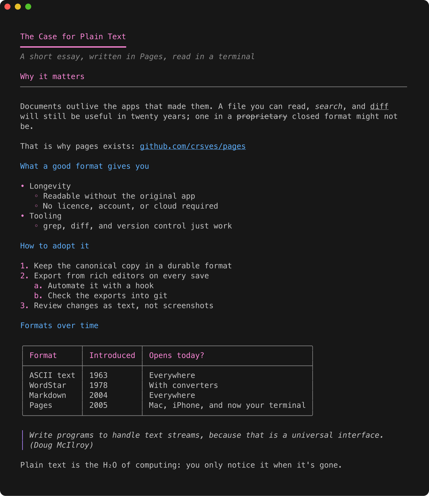

# pages

[](https://github.com/crsves/pages/actions/workflows/ci.yml)
[](https://crates.io/crates/pages-cli)
[](LICENSE)

Apple Pages documents, rendered in your terminal. View them, page through them, and
`git diff` them, without opening Pages. Works on macOS and Linux.

<!-- Demo video: when editing on github.com, drag pages-demo.mp4 onto this line. -->



## Install

```sh
brew install crsves/tap/pages      # Homebrew (macOS, Linux)
cargo binstall pages-cli           # prebuilt binary via cargo-binstall
cargo install pages-cli            # build from source
```

On Debian and Ubuntu, download the `.deb` from the
[releases page](https://github.com/crsves/pages/releases) and run
`sudo apt install ./pages_*.deb`. The same page has tarballs for macOS and Linux (x86_64 and
arm64). An AUR package is ready in [`packaging/aur`](packaging/aur) and will be published
once AUR account registration reopens.

## Usage

```sh
pages essay.pages          # print to stdout
pages -p essay.pages       # open in a pager ($PAGER, default `less -R`)
pages -w 72 essay.pages    # wrap at 72 columns
pages --color never a.pages b.pages
```

`pages` reads the file directly, so Pages.app doesn't need to be installed. It decodes the
IWA format (Snappy-compressed protobuf) with a small hand-written reader.

## Integrations

### `git diff` for Pages documents

Git treats `.pages` files as binary. Point it at `pages` and diffs become readable text:

```sh
echo '*.pages diff=pages' >> .gitattributes
git config diff.pages.textconv "pages --color never"
```

```diff
   Why it matters
-  Documents outlive the apps that made them.
+  Documents outlive every app that made them.
```

Use `git config --global` and `~/.config/git/attributes` to turn it on everywhere.

### fzf

```sh
fzf --preview 'pages --color always -w $FZF_PREVIEW_COLUMNS {}'
```

### yazi

With the [piper](https://github.com/yazi-rs/plugins/tree/main/piper.yazi) plugin, in
`~/.config/yazi/yazi.toml`:

```toml
[[plugin.prepend_previewers]]
url = "*.pages"
run = 'piper -- pages --color always -w "$w" "$1"'
```

### ranger

In `~/.config/ranger/scope.sh`, inside `handle_extension`:

```sh
        pages)
            pages --color always -w "${PV_WIDTH}" -- "${FILE_PATH}" && exit 4
            exit 1;;
```

## What renders

- Title, subtitle, and headings (from the paragraph style; also big, short, bold body
  paragraphs formatted by hand)
- Bold, italic, underline, strikethrough, and super/subscript
- Bulleted, numbered (decimal, roman, alpha, tiered), and nested lists
- Tables with box drawing; header rows are highlighted, and wide tables shrink to fit
- Hyperlinks: clickable OSC 8 links on stdout, URL shown after the link text in the pager
  or with `--color never`
- Block quotes and text boxes
- Placeholders for images, charts, and video

Colour is on when stdout is a TTY and `NO_COLOR` is unset.

## Limits

- Cell number formats (currency, percent, and so on) aren't applied. Numbers show their raw
  value, and text cells show what was typed.
- Merged table cells show as separate cells.
- Headers and footers, comments, and tracked changes are skipped.
- Pages '09 (XML) files aren't supported, and neither are tables saved by Pages versions
  before 2019 (they show a placeholder).
- Footnotes are decoded but haven't been checked against real documents yet.
- iCloud files that haven't been downloaded can't be read. Open them in Finder first.

If a document renders wrong, please [open an issue](https://github.com/crsves/pages/issues).
See [CONTRIBUTING.md](CONTRIBUTING.md) for how to share a problem document safely.

## Build

```sh
cargo install --path .
cargo test
PAGES_FUZZ_ITERS=20000 cargo test --release --test robustness   # longer corruption run
```

Requires Rust 1.85+. Packagers can generate a man page and completions with
`pages --generate-man` and `pages --generate-completions <bash|zsh|fish|elvish|powershell>`.

`tests/fixtures/*.pages` were made by building a `.docx` with `mkdocx*.py` (python-docx),
then opening it in Pages, saving it as a `.pages` file, and keeping only the `Index/*.iwa`
archives (no previews, images, or document metadata).
